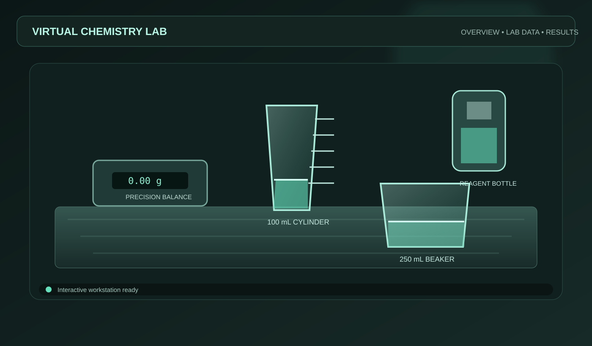
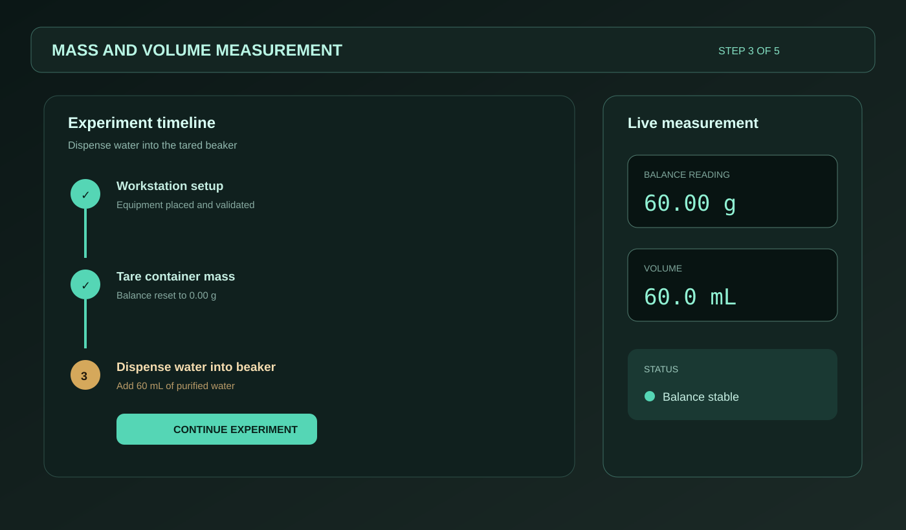
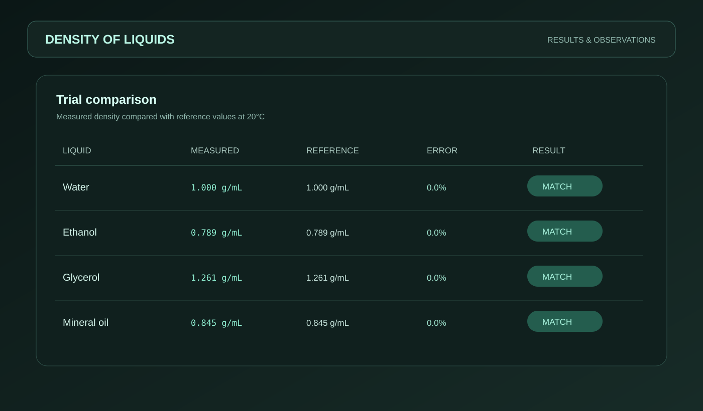

<div align="center">

# Virtual 3D Chemistry Laboratory

**A hands-on chemistry lab for the browser.**

Explore laboratory equipment, measure mass and volume, transfer liquids, and calculate density in an interactive 3D workspace built for learning by doing.

<p>
  <a href="https://github.com/123bruke/3d_labs"></a>
  
  
  
  
</p>

</div>

---

## What is this?

The Virtual 3D Chemistry Laboratory is an interactive learning environment where chemistry concepts become something you can see and manipulate.

Instead of only reading about tare measurements, menisci, or density, you can set up the equipment, pour the liquid, watch the balance settle, and record the result. The goal is not to replace a real laboratory—it is to make the reasoning behind common laboratory procedures easier to understand and practice.

The project currently includes two guided experiments:

- **Mass and Volume Measurement** — practice taring a balance, reading a graduated cylinder, and comparing the mass and volume of water.
- **Density of Liquids** — measure mass and volume, calculate `ρ = m / V`, and compare water, ethanol, glycerol, and mineral oil.

## See it in action

These branded preview images are included in the repository so the project has a visual introduction even before a live deployment is available.

### The 3D laboratory workspace



*The main workspace brings the balance, graduated cylinder, beaker, and reagent dispenser together in one interactive scene.*

### Guided experiment workflow



*Experiments are broken into clear steps while the measurement panel keeps the important readings visible.*

### Density results



*The results view makes it easy to compare measured density with reference values.*

> **Note:** The images above are lightweight project preview illustrations created for the README. Replace them with captured application screenshots in the same folder whenever you have a deployed or running build.

## Highlights

- Move and position equipment on the 3D workbench.
- Place containers on the digital balance and tare the vessel mass.
- Dispense and transfer liquids between containers.
- Track volume and balance readings as the scene changes.
- Follow guided experiment steps with hints and validation.
- Record observations and review the final result.
- Switch between overview and experiment camera views.
- Toggle laboratory lighting and heat effects.

## How the experience works

1. **Choose an experiment** from the experiment selector.
2. **Prepare the workstation** with the required equipment.
3. **Set up the measurement** by placing a container on the balance and taring it.
4. **Add or transfer liquid** using the interactive controls.
5. **Read the result** from the balance and graduated cylinder.
6. **Calculate and record** the relevant measurement or density.
7. **Review the result** and reset the lab for another trial.

## Built with

| Area | Technology |
| --- | --- |
| UI | React 19, TypeScript |
| 3D rendering | Three.js, React Three Fiber, `@react-three/drei` |
| State | Zustand |
| Styling | Tailwind CSS and custom CSS |
| Build tooling | Vite, esbuild |
| Motion and icons | Motion, lucide-react |
| AI integration | Google GenAI SDK |
| Server support | Express and dotenv |

## Project structure

```text
src/
├── chemistry/                 # Experiment, equipment, and material definitions
├── components/               # Interface panels, drawers, modals, and navigation
├── simulation/               # Measurements, validation, experiment flow, and audio
├── store/                    # Zustand laboratory state
├── three/                    # 3D scene and React Three Fiber objects
├── types/                    # Shared TypeScript types
├── App.tsx                   # Application composition and flow overlays
└── main.tsx                  # Frontend entry point

docs/
└── screenshots/              # README preview images
```

## Run it locally

### Requirements

- Node.js 20 or newer
- npm or Bun
- A browser with WebGL support

### Install and start

```bash
git clone https://github.com/123bruke/3d_labs.git
cd 3d_labs
npm install
cp .env.example .env
npm run dev
```

Open [http://localhost:3000](http://localhost:3000) in your browser.

For local configuration, update `.env` when needed:

```env
GEMINI_API_KEY="YOUR_GEMINI_API_KEY"
APP_URL="http://localhost:3000"
```

Do not commit real API keys. In AI Studio, configure secrets through the platform's Secrets panel.

## Available commands

| Command | Purpose |
| --- | --- |
| `npm run dev` | Start Vite on port `3000` |
| `npm run build` | Build the app for production |
| `npm run preview` | Preview the production build locally |
| `npm run lint` | Run TypeScript without emitting files |
| `npm run clean` | Remove generated build artifacts |

## A note on simulation accuracy

This is an educational simulation, not a laboratory-grade measurement instrument. Values are modeled to support the learning workflow, including balance readings, liquid capacities, tare offsets, density comparisons, and temperature-related lab state. Results should not be used for real-world chemical, medical, or engineering decisions.

## Contributing

If you have an idea for a new experiment, a more realistic interaction, or a better way to explain a chemistry concept, contributions are welcome.

1. Fork the repository.
2. Create a branch: `git checkout -b feature/my-improvement`.
3. Make your changes and run `npm run lint` and `npm run build`.
4. Open a pull request with a short explanation and screenshots or a screen recording when the change affects the interface.

## License

No license has been declared for this repository yet. Until a license is added, the code should be treated as **all rights reserved**. If you plan to share or reuse the project, add a license that matches your intended use.

---

<div align="center">
  Made for curious learners who would rather <strong>try the experiment</strong> than only read about it.
</div>
